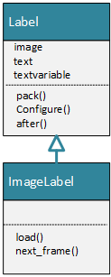

<h1>TKinter Learning Notes</h1>

[image converter, mp4>gif, png>ico](https://cloudconvert.com/)

❓What is tkinter?
>✔️This framework provides Python users with a simple way to create GUI elements using the widgets found in the Tk toolkit. Tk widgets can be used to construct buttons, menus, data fields, etc. in a Python application.
* [Good tkinter document online](https://anzeljg.github.io/rin2/book2/2405/docs/scale.html)
* [YouTube tutorial](https://www.youtube.com/watch?v=YXPyB4XeYLA)
* [油管系列讲座](https://www.youtube.com/watch?v=yQSEXcf6s2I&list=PLCC34OHNcOtoC6GglhF3ncJ5rLwQrLGnV)
* [atom version](https://www.youtube.com/watch?v=itRLRfuL_PQ) 

📌❗️ **Knowlodge Base**
in tkinter everyting is widget

- [open window](#open-window)
- [switch between frame](#switch-between-frame)
- [Label, Button, Entry widgets](#label-button-entry-widgets)
  - [pack attributes](#pack-attributes)
- [pack layout](#pack-layout)
- [grid layout](#grid-layout)
- [place layout](#place-layout)
- [icon and title](#icon-and-title)
- [Other widgets](#other-widgets)
- [color](#color)
- [mouse](#mouse)
- [table](#table)
- [canvas](#canvas)
- [tab window frame](#tab-window-frame)
- [titled frame](#titled-frame)
- [plot chart in tkinter](#plot-chart-in-tkinter)
- [display image](#display-image)
- [popup window](#popup-window)
- [card game GUI](#card-game-gui)
- [configure background color](#configure-background-color)
- [Animated GIF (Graphics Interchange Format)](#animated-gif-graphics-interchange-format)
- [What we have learned in Blackjack Game](#what-we-have-learned-in-blackjack-game)
- [Write Python Program](#write-python-program)
- [deploy the game - PyInstaller](#deploy-the-game---pyinstaller)
- [Code block](#code-block)
- [Function](#function)
- [Class](#class)
- [Calculator](#calculator)
- [Sticker](#sticker)
- [temperature converter](#temperature-converter)
- [tic tak toe](#tic-tak-toe)
- [date Interval](#date-interval)
- [image editor](#image-editor)


## open window
* [open window with title](../src/tkinter1.py)

## switch between frame
* [Switch between two Frames](../src/tkinter71.py)

## Label, Button, Entry widgets
* [Add label to window](../src/tkinter2.py)
### pack attributes
  * after=widget1 - pack this widget after widget1
  * before=widget1 - pack this widget before widget1
  * anchor='border' - where **border** must be n, ne, e, se, s, sw, w, nw, or center 
  * fill=NONE, or X, Y, BOTH
  * padx, pady
  * ipadx, ipady
  * side='top', 'left', 'right', 'bottom'
* [dynamically change label text](../src/tkinter46.py)
* [change font of the label](../src/tkinter3.py)
  - 💡Find available font: ✔️Control Panel ⇒ Apperance and Personalization ⇒ Fonts
  - [font folder location](C:\Windows\Fonts)
* [add button](../src/tkinter4.py)
* [button action > print text on console](../src/tkinter6.py)
* [lambda expression on button action](../src/tkinter48.py)
* [button, quit, icon, image](../src/tkinter53.py)
>In order to use PIL, you need install module Pillow
```
pip install Pillow
```
* [use tkinter Entry](../src/tkinter47.py)

## pack layout
* [GUI Layout Management>pack](../src/tkinter26.py)
* [pack(fill=tk.X)](../src/tkinter27.py)
* [w.pack(fill=tk.X, padx=10, pady=5)](../src/tkinter28.py)
* ☝️[pack(fill=tk.X, pady=10)](../src/tkinter29.py)
* [pack(padx=5, pady=10, side=tk.LEFT)](../src/tkinter30.py)

## grid layout
* [grid()](../src/tkinter06.py)
* [Grid system](../src/tkinter50.py)
  - pack() and place() can be used together
  - grid() and place() can be used together
  - pack() and grid() cannot be used same time.

## place layout
* [Place system](../src/tkinter51.py)

## icon and title
* [Place system](../src/tkinter52.py)
* 
## Other widgets
* [using Combox, dropdown box](../src/tkinter7.py)
* [using checkbox](../src/tkinter8.py)
* [using spinbox](../src/tkinter9.py)
* [using text field](../src/tkinter10.py)
* [using form](../src/tkinter11.py)
* [radio button](../src/tkinter55.py)
* [using radio button and message box](../src/tkinter12.py)
* [using yes/no, ok/cancel message](../src/tkinter57.py)
* [Same as above, use pack instead of grid](../src/tkinter13.py)
* [using scrolled text](../src/tkinter14.py)
* [Horizontal scrooled bar]()
* [using progress bar](../src/tkinter15.py)
* [enable/disable button](../src/tkinter16.py)
* [using list box](../src/tkinter17.py)
* [same as above with multiple selection](../src/tkinter18.py)
* [using dialog](../src/tkinter19.py)
* [using tk.Frame](../src/tkinter20.py)
* [close window call back, display image](../src/tkinter21.py)
* [using filedialog](../src/tkinter22.py)
* [better version of tkinter22](../src/tkinter23.py)
* [using save file dialog](../src/tkinter24.py)
* [menubar = tkinter.Menu(root)](../src/tkinter25.py)
* [slider (Scale)](../src/tkinter59.py)
* [Scale: command](../src/tkinter60.py)
  😄👍[Good website](https://anzeljg.github.io/rin2/book2/2405/docs/scale.html)

## color
* [random background color](../src/tkinter31.py)
* [built in color list](../src/tkinter32.py)

## mouse 
* [mouse double click](../src/tkinter33.py)
* [mouse position](../src/tkinter34.py)

## table
* [create a table](../src/tkinter35.py)

## canvas
* [using canvas draw pie chart](../src/tkinter36.py)
* [draw line in canvas](../src/tkinter5.py)
* 👎😢[data not available](../src/tkinter37.py)

## tab window frame
* [tab window](../src/tkinter38.py)

## titled frame
* [titled frame](../src/tkinter39.py)
* [using frame](../src/tkinter56.py)
* [open more than one window](../src/tkinter58.py)

## plot chart in tkinter
* [canvas.draw() chart on canvas](../src/tkinter40.py)
* [plot chart dynamically](../src/tkinter41.py)

## display image
* [put image in frame](../src/tkinter44a.py)
* [display image on frame](../src/tkinter42.py)
* [deal cards in window](../src/tkinter43.py)
* [class MyFrame basic](../src/tkinter44.py)
* [Calculator button on frame](../src/tkinter44b.py)
* [delete label](../src/tkinter70.py)
* [display animated gif](../src/displayGif.py)


## popup window
* [popup window](../src/tkinter45.py)

## card game GUI
* [card game gui](../src/tkinter44c.py)
* [Switch between frames](../src/tkinter71.py)
* [use class switch frames](../src/tkinter72.py)
* [Extends from Frame](../src/tkinter73.py)
* [Display image, title, button](../src/blackjack0.py)
* [Pack Button](../src/tkinter79.py)
* [Grid Button](../src/tkinter80.py)
* [Configure Frame, lose animation](../src/blackjack01.py)
* [Understand pack](../src/tkinter26.py)
* [Pack horizontal](../src/tkinter77.py)
* [Pack top horizontal](../src/tkinter78.py)
* [Animated Configure Frame](../src/blackjack2.py)
* [display animated gif](../src/gif.py)
* [Control and Board frame](../src/blackjack3.py)
* [Deal Card button and name list](../src/blackjack4.py)
* [Control frame and player name list](../src/blackjack5.py)
* [Control frame and seat location](../src/blackjack6.py)
* [Add Card, Dealer, Deck classes](../src/blackjack7.py)
* [Display dealed card for each player](../src/blackjack8.py)
* [Titled frame](../src/tkinter39.py)
* [Game result frame](../src/tkinter76.py)
* [Add Game result frame](../src/blackjack9.py)
* [Switch between two Frames](../src/tkinter71.py)
* [Switch two board](../src/blackjack11.py)
* [Before add popup window](../src/blackjack1.py)
* [popup sample](../src/popup.py)
* [set player's name](../src/popup1.py)
* [list selection](../src/list.py)
* [ComboBox](../src/combobox.py)
* [Add popup window for set player's seat, update label as well](../src/blackjack2.py)
* [set player's seat](../src/blackjack12.py)


* [Check box](../src/checkbox.py)
* [Radio button](../src/radioButton.py)

## configure background color

1. create popup
2. create list color
3. set background of playboard

* [set board background](../src/blackjack13.py)
* [align up radio buttons](../src/blackjack14.py)

## Animated GIF (Graphics Interchange Format)
❓ What is GIF file?
✔️ An animated GIF (Graphics Interchange Format) file is a graphic image on a Web page that moves, which contains within the single file a set of images that are presented ina specified order. An animated GIF can loop endlessly, or it can present one or a few sequences and then stop the animation.

1. Contains more than one image frames;
2. may contains duration for each frame;
3. can be displyed repeatedly;
4. Python cannot display the GIF animation automatically like Java does;
5. you need write your own code to display the animated GIF in Python.


* [built in function next()](../src/builtinNext.py)

```dos
>>> from itertools import count, cycle
>>> l1=[1,2,3,4,5]
>>> print(type(l1))
<class 'list'>
>>> next(l1)
Traceback (most recent call last):
  File "<stdin>", line 1, in <module>
TypeError: 'list' object is not an iterator
>>> l1 = cycle(l1)
>>> next(l1)
1
>>>
```

* [range1 start from 1 include stop](../src/range1.py)

* [display animated gif](../src/displayGif.py)
* [Define class ImageLabel](../src/blackjackgif.py)




* [blackjack animation gif](../src/blackjack.py)


💡⚡️ **Knowlodge Base**
1. difference between buildFrame and extends **Frame**
2. change class to build frame function
3. change block code to build frame function


👍😄 [Good sample for gif animation](https://pythonprogramming.altervista.org/animate-gif-in-tkinter/)

## What we have learned in Blackjack Game
* create MainFrame class from BaseWindow defined in tkinterbase.py;
* switch two frames by buttons defined in those frames; [](../src/switch)
* Using Frame to create display frame;
* Display image by using Label;
* create popup window for configuration;
* create ComboBox for selection;
* Create Buttons, and enable/disable buttons;
* Display card as Label and destroy the label;
* Update Label text (Configure(), textvariable);
* use pack(), grid(), place() to add widget on screen;
* Use LabelFrame() for titled frame (PlayBoardFrame.buildResultFrame())
* Update player's name based on user input
* Update background color based on user input
* align radio buttons (button.pack(anchor=W), additional frame)
* display animated GIF file (ConfigFrame.__init__(), blackjackgif.py)


## Write Python Program


## deploy the game - PyInstaller
[Tkinter to Exe]()
```DOS
pip install pyinstaller
mkdir exe
cd exe
<copy python file to this folder>
pyinstaller -F -w temperatureConverter.py
pyinstaller -F -w blackjack.py
```
>
## Code block
* [Direct write python code](../src/print.py)

## Function


*[](../src/circleArea.py)

## Class


## Calculator
* [lambda button action](../src/lambdaButtonAction.py)
* [](../src/lambda01.py)
* [](../src/lambda02.py)
* [](../src/lambda03.py)
* [Calculator](../src/calculator.py)

## Sticker
[Sticker ](../src/sticker.py)

## temperature converter
[temperature converter](../src/temperatureConverter.py)

## tic tak toe
[tictaktoe](../src/tictaktoe.py)

## date Interval
[date interval](../src/dateInterval.py)

## image editor
[functions to make image change](changeImage.py)