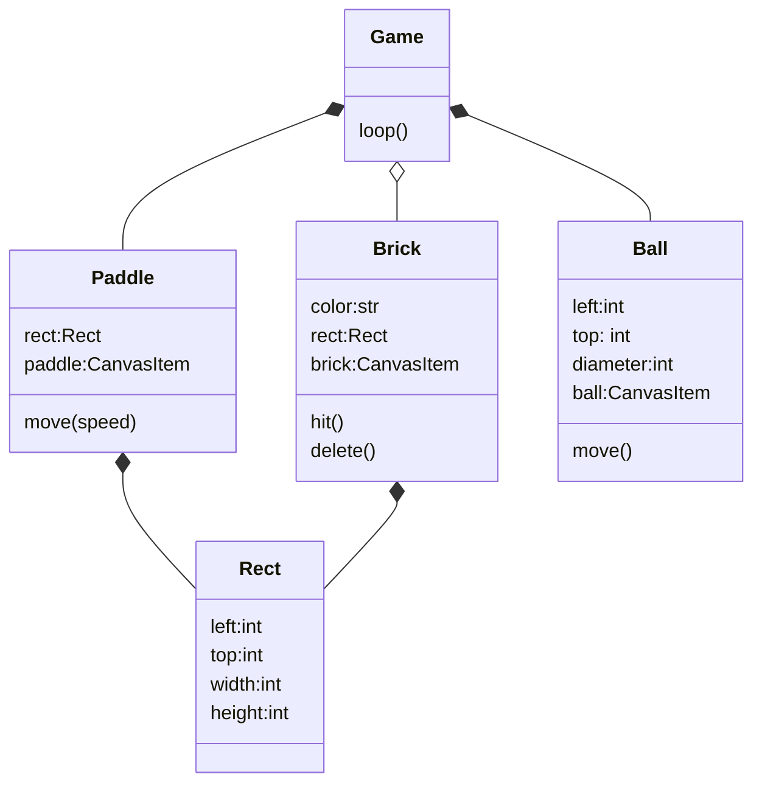

<h1>Hit down brick</h1>

- [start up](#start-up)
- [Objects in the game](#objects-in-the-game)
- [draw one brick](#draw-one-brick)
- [draw all bricks](#draw-all-bricks)
- [draw ball and paddle](#draw-ball-and-paddle)
- [move ball](#move-ball)
- [move paddle](#move-paddle)
- [reflect on paddle](#reflect-on-paddle)
- [hit brick](#hit-brick)
- [Create Rect class](#create-rect-class)
- [add sound effect](#add-sound-effect)


## start up
[Open game window](brick01.py)

## Objects in the game



## draw one brick
[draw one brick](brick02.py)

## draw all bricks
[draw all bricks](brick03.py)

## draw ball and paddle
[draw ball and paddle](brick04.py)

## move ball
* [use canvas.after() generate loop](move1.py)
* [bounce back on window edge](move2.py)
* [bounce ball](brick05.py)

## move paddle
* [bind left/right key with paddle motion](brick06.py)

## reflect on paddle
* [bounce back on paddle](brick07.py)

## hit brick
* [remove brick](brick08.py)

```py
self.brick = self.canvas.create_rectangle(x,y,x + self.width,y+self.height,fill=color)
... ...
self.canvas.delete(self.brick)
```
* [hit brick]()


## Create Rect class
* [draw rectangle and circle](rect1.py)
* [test collide circle with rectangle]()

## add sound effect

```dos
(env) C:\Users\12818\workspace\tkinter>pip install playsound
```