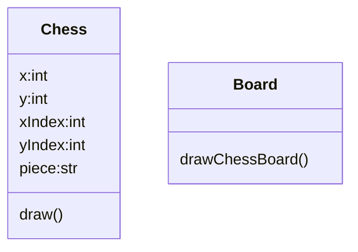

<h1>Five chess in line Game</h1>

## Getting started
* [Start from basic window](fiveinline01.py)

## Draw Chess Board
* [draw chess board and get point by mouse click](fiveinline02.py)

* [Start up with possible objects](fiveinline10.py)
* [draw chess board](fiveinline11.py)
* [response mouse click](fiveinline12.py)

* [draw chess on mouse click](fiveinline13.py)
* 
